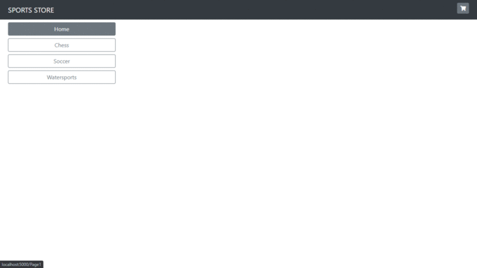

# sports-store
Sports store built with ASP.Net Core.

## :book: Pro ASP.NET Core 3 (Develop Cloud-Ready Web Applications Using MVC 3, Blazor, and Razor Pages) 8th ed. Edition
Project described in this [book](https://www.amazon.com/Adam-Freeman/dp/1484254392) (Chapters 7-11).

> My goal in this chapter and those that follow is to give you a sense of what real ASP.NET Core development is by creating
as realistic an example as possible.
> ➞ Adam Freeman

## Screenshots :camera:

